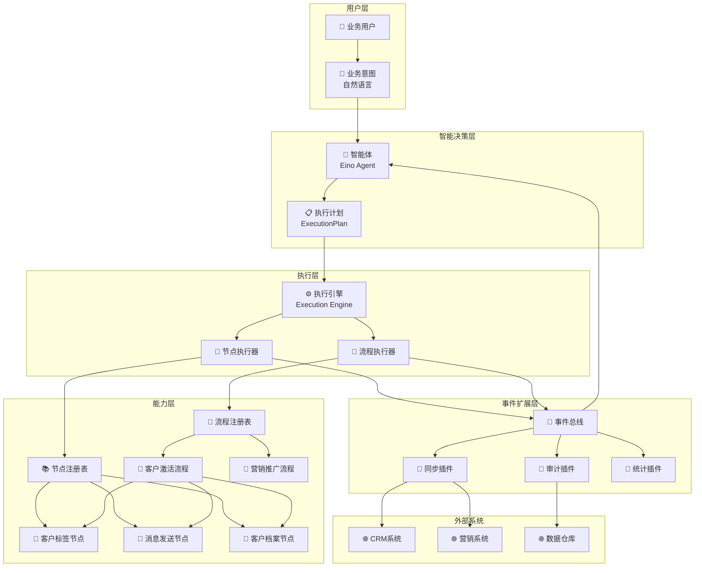
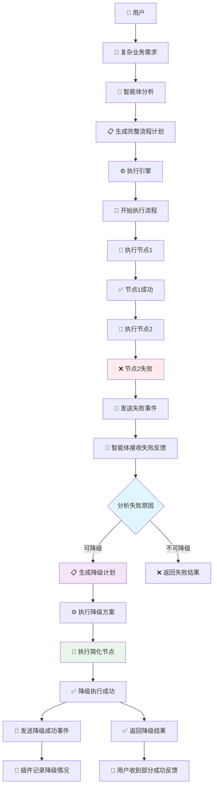

# CoreX + Eino 智能体业务架构规划

## 🎯 业务目标

构建一个智能化的业务执行平台，让用户通过自然语言表达业务意图，系统自动理解并执行相应的业务操作。实现从"用户想法"到"业务结果"的智能化闭环。

## 🏗️ 核心业务概念

### 1. 智能体（Agent）
**业务角色**：智能业务助手
- **职责**：理解用户的业务意图，制定执行策略
- **能力**：
  - 理解自然语言业务需求
  - 分析业务场景复杂度
  - 选择最优执行方案
  - 处理执行异常和降级

### 2. 执行计划（ExecutionPlan）
**业务角色**：标准化的业务指令
- **作用**：将用户意图转化为系统可执行的标准指令
- **包含内容**：
  - 执行类型（单一操作 vs 复合流程）
  - 具体操作名称
  - 业务参数
  - 执行策略（优先级、超时、降级方案）

### 3. 业务节点（Node）
**业务角色**：原子业务操作
- **定义**：不可再分的最小业务单元
- **特点**：
  - 单一职责，功能明确
  - 可独立执行
  - 可被组合复用
  - 执行结果标准化

### 4. 业务流程（Flow）
**业务角色**：复合业务场景
- **定义**：多个业务节点的有序组合
- **适用场景**：
  - 多步骤业务流程
  - 需要条件判断的业务
  - 涉及多个系统的业务
  - 需要异常处理的复杂业务

### 5. 事件总线（EventBus）
**业务角色**：业务事件通信中心
- **作用**：记录和传播业务执行过程中的所有事件
- **价值**：
  - 业务过程可追溯
  - 支持业务扩展
  - 实现业务解耦

### 6. 业务插件（Plugin）
**业务角色**：业务扩展模块
- **作用**：在不影响主业务流程的情况下，添加额外的业务功能
- **应用场景**：
  - 业务审计记录
  - 外部系统同步
  - 业务指标统计
  - 后续业务触发

## 🔄 业务对象关系图



## 📋 核心业务功能需求

### 1. 意图理解功能
**需求描述**：系统能够理解用户的自然语言业务需求
- **输入**：用户的自然语言描述
- **处理**：意图识别、参数提取、上下文理解
- **输出**：结构化的业务需求

### 2. 智能决策功能
**需求描述**：根据业务需求选择最优的执行方案
- **决策维度**：
  - 业务复杂度（单一操作 vs 复合流程）
  - 执行效率（直接执行 vs 分步执行）
  - 风险控制（正常流程 vs 降级方案）
  - 资源消耗（简单方案 vs 完整方案）

### 3. 统一执行功能
**需求描述**：提供统一的业务执行入口和管理
- **执行类型**：
  - 单节点执行：直接调用单个业务操作
  - 流程执行：按序执行多个业务操作
- **执行控制**：
  - 超时控制
  - 优先级管理
  - 并发控制
  - 异常处理

### 4. 业务编排功能
**需求描述**：支持复杂业务场景的流程编排
- **编排能力**：
  - 顺序执行：按步骤依次执行
  - 条件分支：根据条件选择执行路径
  - 并行执行：同时执行多个操作
  - 循环执行：重复执行某些操作
  - 异常处理：处理执行失败的情况

### 5. 事件追踪功能
**需求描述**：记录和追踪所有业务执行过程
- **事件类型**：
  - 执行开始事件
  - 执行完成事件
  - 执行失败事件
  - 状态变更事件
- **追踪维度**：
  - 时间维度：什么时候发生
  - 空间维度：在哪里发生
  - 主体维度：谁执行的
  - 对象维度：对什么执行

### 6. 业务扩展功能
**需求描述**：支持业务功能的灵活扩展
- **扩展方式**：
  - 插件式扩展：通过插件添加新功能
  - 事件驱动扩展：通过事件触发扩展功能
  - 配置式扩展：通过配置启用扩展功能

## 🎬 典型业务场景

### 场景1：简单业务操作
**业务描述**：客服人员需要给客户打标签

```mermaid
flowchart TD
    A[👤 客服人员] --> B[💭 "给客户张三打VIP标签"]
    B --> C[🧠 智能体分析]
    C --> D{业务复杂度判断}
    D -->|简单操作| E[📋 生成单节点计划]
    E --> F[⚙️ 执行引擎]
    F --> G[🔧 执行标签节点]
    G --> H[📡 发送执行事件]
    H --> I[🔌 审计插件记录]
    H --> J[🔌 同步插件更新CRM]
    G --> K[✅ 返回执行结果]
    K --> L[👤 客服收到成功反馈]
    
    style D fill:#e1f5fe
    style E fill:#f3e5f5
    style G fill:#e8f5e8
```

### 场景2：复杂业务流程
**业务描述**：营销人员需要执行客户激活流程

```mermaid
flowchart TD
    A[👤 营销人员] --> B[💭 "激活流失客户李四，打VIP标签并发欢迎消息"]
    B --> C[🧠 智能体分析]
    C --> D{业务复杂度判断}
    D -->|复杂流程| E[📋 生成流程计划]
    E --> F[⚙️ 执行引擎]
    F --> G[🔄 启动客户激活流程]
    
    G --> H[🔧 步骤1：获取客户档案]
    H --> I[📡 发送节点执行事件]
    I --> J{客户状态检查}
    J -->|活跃客户| K[🔧 步骤2：打VIP标签]
    J -->|非活跃客户| L[🔧 步骤2：打普通标签]
    
    K --> M[📡 发送节点执行事件]
    L --> M
    M --> N[🔧 步骤3：发送个性化消息]
    N --> O[📡 发送节点执行事件]
    O --> P[📡 发送流程完成事件]
    
    P --> Q[🔌 审计插件记录完整流程]
    P --> R[🔌 统计插件更新转化率]
    P --> S[🔌 同步插件更新多个系统]
    
    N --> T[✅ 返回流程结果]
    T --> U[👤 营销人员收到完成反馈]
    
    style D fill:#e1f5fe
    style E fill:#f3e5f5
    style G fill:#fff3e0
    style J fill:#e8f5e8
```

### 场景3：异常处理与降级
**业务描述**：执行过程中遇到异常，需要智能降级



## 🎯 业务价值与收益

### 1. 用户体验提升
- **自然交互**：用户可以用自然语言表达业务需求
- **智能理解**：系统能准确理解用户意图
- **快速响应**：自动选择最优执行方案
- **结果反馈**：及时反馈执行结果和状态

### 2. 业务效率提升
- **操作简化**：复杂业务操作简化为自然语言描述
- **自动执行**：减少人工操作，提高执行效率
- **智能决策**：自动选择最优执行路径
- **异常处理**：自动处理异常情况，减少人工干预

### 3. 系统可扩展性
- **模块化设计**：业务功能模块化，易于扩展
- **插件机制**：支持业务功能的灵活扩展
- **事件驱动**：通过事件实现系统解耦
- **标准化接口**：统一的执行接口，便于集成

### 4. 业务可观测性
- **全程追踪**：记录完整的业务执行过程
- **事件审计**：所有业务操作都有审计记录
- **性能监控**：监控业务执行性能和成功率
- **问题诊断**：快速定位和诊断业务问题

## 🚀 实施路径规划

### 阶段1：基础能力建设
**目标**：建立核心的智能体执行框架
- 实现基础的意图理解能力
- 建立执行计划标准格式
- 实现统一的执行引擎
- 建立基础的事件机制

### 阶段2：业务场景覆盖
**目标**：覆盖主要的业务场景
- 实现常用的业务节点
- 设计典型的业务流程
- 建立业务插件机制
- 完善异常处理逻辑

### 阶段3：智能化增强
**目标**：提升系统的智能化水平
- 增强意图理解的准确性
- 优化执行策略的选择
- 实现智能的异常处理
- 建立学习和优化机制

### 阶段4：生态完善
**目标**：建立完整的业务生态
- 提供可视化的流程设计工具
- 建立业务模板和最佳实践
- 完善监控和运维工具
- 建立开发者生态

## 📊 成功指标定义

### 业务指标
- **意图理解准确率**：≥95%
- **执行成功率**：≥99%
- **平均响应时间**：≤3秒
- **用户满意度**：≥4.5/5.0

### 技术指标
- **系统可用性**：≥99.9%
- **并发处理能力**：≥1000 TPS
- **异常恢复时间**：≤30秒
- **扩展性**：支持水平扩展

### 运营指标
- **日活跃用户数**：持续增长
- **业务场景覆盖率**：≥80%
- **插件生态丰富度**：≥50个插件
- **开发者采用率**：持续增长